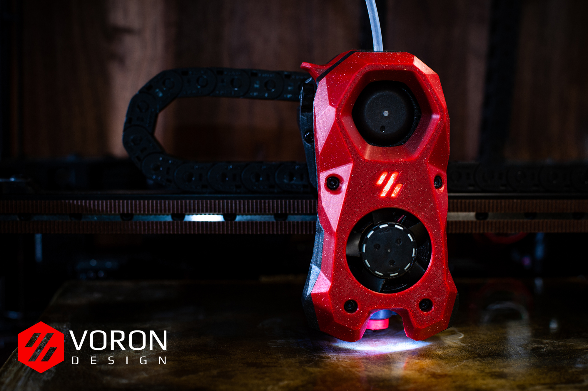
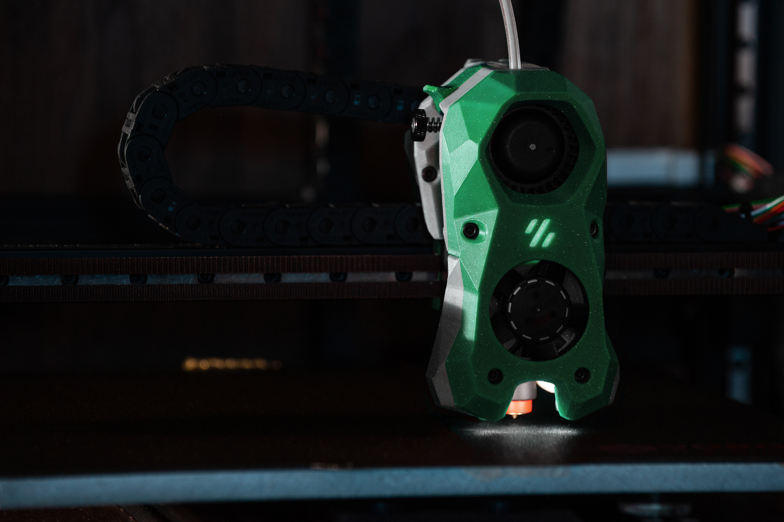
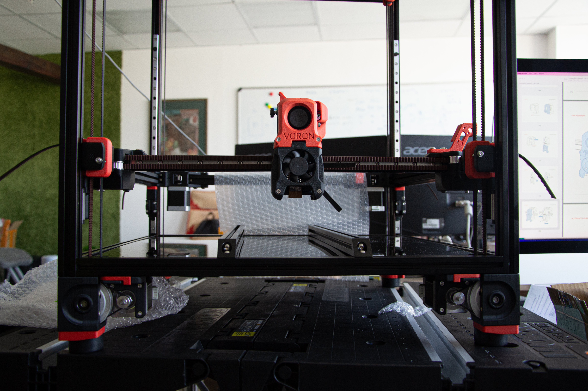
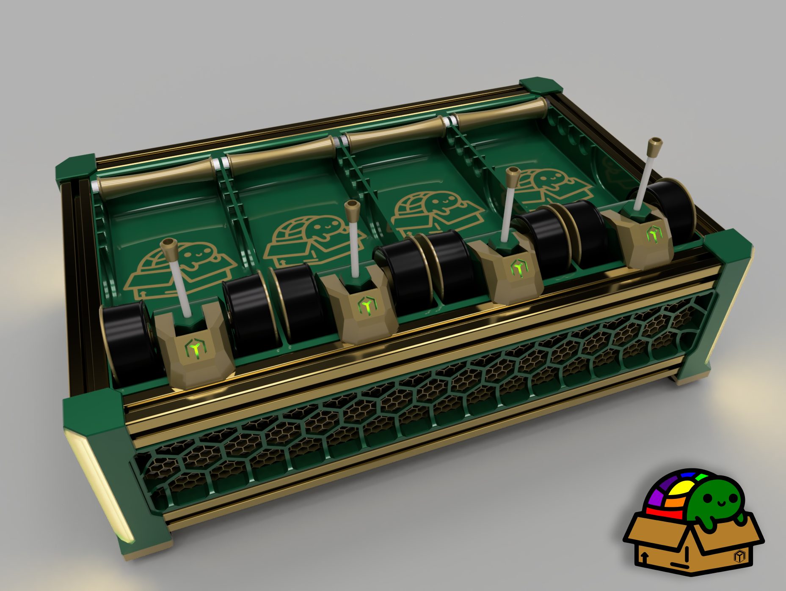

<!-- _class: lead -->

# Building a Voron 2.4

### A precision, multi-material 3D printer — the plan, the options, and the costs

A hobby build proposal • self-sourced • done in phases

---

<!-- _class: lead -->

## Executive Summary

I'd like to build a new printer — a self-sourced, enclosed, precision printer.

| |                                      |
|---|--------------------------------------|
| **What** | A 300 mm Voron 2.4 R2 (0.4 mm, multi-material, enclosed) |
| **Why** | The fun of building + multimaterial printing |
| **Cost** | ≈ **$1,850** core, ≈ **$2,040** after multi-material |
| **How** | In phases — always a working printer |

Prices are working estimates, being finalized part-by-part.

---

## Why do this?

- **The build itself is the point.** Getting the Kobra Max running was a blast — a Voron is a bigger, more satisfying version of that.
- **It fills a gap.** Our printers are single-material and fussy. A Voron is:
  - **Multi-material** — multi-color / multi-part prints in one go
  - **Enclosed** — can print ABS/ASA (stronger, heat-resistant parts)
  - **Precise & fast** — CoreXY motion, cleaner than our current machines
- **It's a learning project** the whole household benefits from.

---

## Current Printers

| Printer | Role today | The catch |
|---------|-----------|-----------|
| **Kobra Max** | Big prints | Wheel-based motion → visible print artifacts; bed needs frequent re-leveling |
| **Ender 3 V3 SE** | Son's 0.4 mm printer | Small, basic, aging |

- Both are **single-material** and **open** (no ABS).
- Both are **bedslingers** — the bed moves back and forth, which slows printing and causes vibrations in the print.

---

## The proposal: a Voron 2.4 R2 (300 mm)

open-source CoreXY enclosed multi-material

A self-sourced, fully-enclosed CoreXY printer — the bed stays still, a light gantry flies, and it **auto-levels itself** every print. What goes in it:

| Module | Key choices |
|--------|-------------|
| **Toolhead** | Revo hotend, Cartographer probe, Galileo 2, filament cutter |
| **Motion & frame** | Linear rails, BTT Octopus, Raspberry Pi 5, MeanWell PSU |
| **Bed** | Cast aluminum + AC heater + PEI — flat, fixed, stable |
| **Enclosure** | Hybrid panels, chamber heater, carbon filter, LED, camera |
| **Multi-material** | **BoxTurtle** auto filament changer — *added in a later phase* |

---

## Why 300 mm (not 250 or 350)?

A **250** would be cheaper — but not by much:

| | 250 build | 300 build |
|---|---|---|
| Estimated cost | ≈ $1,773 | ≈ $1,845 |
| **Difference** | | **only ≈ $72 (~4%)** |
| Build volume | 15.6 L | 27 L |

- Most parts — electronics, motors, motion, heater, toolhead — **cost the same at any size.**
- Dropping to 250 saves ~4% but **gives up ~42% of the build volume** — a 300 fits **73% more** than a 250.
- A **350** is an option too, but may be harder to calibrate.
- **→ 300 is the sweet spot.**

---

## What happens to the other printers?

Several ways to go — this is a family decision:

| Option | Kobra | Ender | Process | You end up with |
|--------|-------|-------|---------|-----------------|
| **A** | Keep & specialize | Retire | Build a new Voron from scratch, upgrade the Kobra extruder and y axis | Voron for multi material, fine detail and exotic plastics + Kobra for fast prints and large prints |
| **F** ⭐ | **Give to son** | Retire | Build a new Voron from scratch | Voron for Andreas; Kobra for Joe |
| **B** | Strip for parts, then sell | Son keeps | Build Voron parts, get them working on the kobra. Eventually build a Voron frame and moves the parts over | Voron for Andreas; Ender for Joe |
| **G** | Sell | Retire | Build a **RatRig 400** (~$2,250+) with a boxturtle | We share one large format, enclosed, multimaterial printer |

---

## The budget

Working estimates

| Module | Estimate |
|--------|---------:|
| Toolhead | ≈ $275 |
| Frame, motion, motors & electronics | ≈ $1,095 |
| Enclosure | ≈ $210 |
| Tools *(one-time, reusable)* | ≈ $86 |
| Fasteners, wire & connectors | ≈ $181 |
| **Core Voron** | **≈ $1,846** |
| + BoxTurtle multi-material *(later phase)* | + $190 |
| **All-in** | **≈ $2,035** |

Only the ~$86 of tools is truly reusable — I keep those forever, for every future print & repair.

---

## Spending it sensibly: phases

The plan is built around **waypoints** — every stage ends with a *working* printer. We can pause at any point.

1. **Print the parts** on our current printers *(≈ filament only)* in petg
2. **Frame + motion + electronics** → a moving, testable machine
3. **Bed + enclosure** → a complete single-material Voron
   - reprint in abs anything that needs to withstand heat
4. **BoxTurtle** → multi-material

---

<!-- _class: lead -->

## The ask

**Approval to start building a Voron 2.4 300** — in phases, ~$1,850–2,050 total, spread over time.

Open questions for us to decide together:
- Which fleet plan (who gets the Kobra)?
- A budget ceiling / per-phase cap?
- Timeline — steady, or "whenever funds allow"?

Detailed line-item pricing lives in the "Printer Upgrades" spreadsheet.

Image credits: Voron Design (Stealthburner) • ArmoredTurtle (BoxTurtle) • Wikimedia Commons / disinterpreter (CC BY-SA 2.0)
